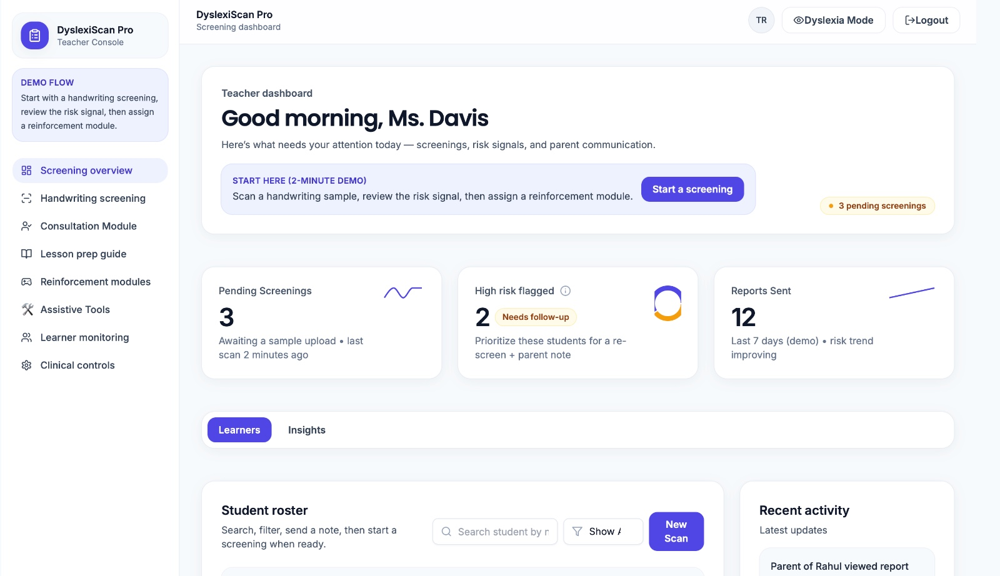
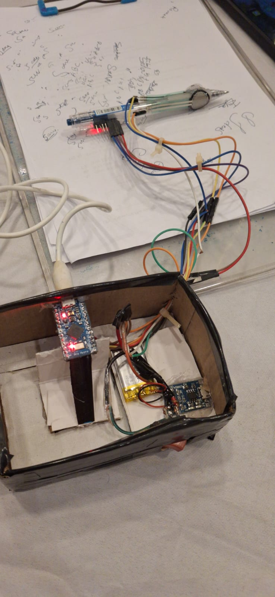
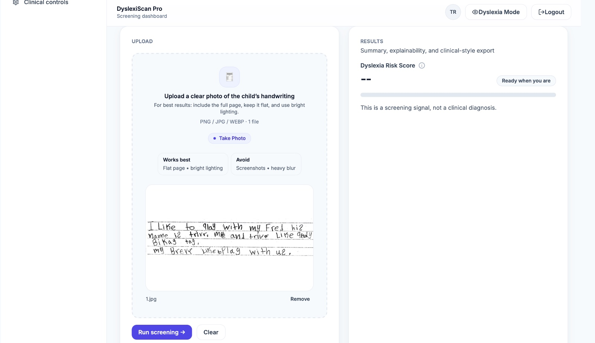

<div align="center">
  <h1>🧠 DyslexiScan AI</h1>
  <p><strong>An IoT and AI-driven early neurodevelopmental screening platform</strong></p>

  
  
  
  
  
</div>

<br />

## 📖 About The Project

DyslexiScan AI is a real-time, hardware-to-cloud diagnostic web platform engineered to assist in the early detection of dyslexia. By utilizing a custom-built smart pen equipped with specialized sensors, the system streams live biomechanical telemetry (such as grip pressure and spatial kinematics) to a deep learning backend. The processed data is then visualized on a zero-latency, clinical-grade web dashboard.

### ✨ Key Features
* **Smart Hardware Integration:** Utilizes a custom pen integrated with FSR (Force-Sensing Resistor) sensors and an MPU6050 (accelerometer/gyroscope) to capture micro-movements and grip pressure during writing tasks.
* **Real-Time IoT Telemetry:** Engineered a robust hardware-software pipeline connecting edge sensors to a Python/Flask REST API for continuous, live data streaming.
* **Deep Learning Engine:** Leverages TensorFlow, Keras, and OpenCV (CNNs) to analyze complex spatial and sensor inputs, extracting high-confidence markers indicative of neurodevelopmental anomalies.
* **Clinical-Grade Dashboard:** A highly responsive frontend built with React, Vite, and Tailwind CSS that renders synchronized data graphs for automated screening tests.

---

## 💻 Tech Stack

### Frontend
* **Framework:** React.js (Vite)
* **Styling:** Tailwind CSS
* **Data Visualization:** Recharts / Chart.js

### Backend & AI
* **Server & API:** Python, Flask, REST APIs
* **Machine Learning:** TensorFlow, Keras, OpenCV, Convolutional Neural Networks (CNNs)
* **Data Processing:** Pandas, NumPy

### Hardware (Edge)
* **Microcontroller:** Arduino
* **Sensors:** FSR Sensors (Grip Pressure), MPU6050 (6-axis Motion Tracking)

---

## 🚀 Getting Started

Follow these steps to set up the project locally.

### 1. Clone the Repository
```bash
git clone [https://github.com/sanashk19/Dyslexiscan-AI.git](https://github.com/sanashk19/Dyslexiscan-AI.git)
cd Dyslexiscan-AI
```

### 2. Backend Setup (Python/Flask)
Navigate to the backend directory, set up your virtual environment, and install the dependencies:

```Bash
cd backend
python -m venv venv
source venv/bin/activate  # On Windows use `venv\Scripts\activate`
pip install -r requirements.txt
python app.py
```
The Flask server will start running on http://localhost:5000.

### 3. Frontend Setup (React/Vite)
Open a new terminal window, navigate to the frontend directory, and start the development server:
```
Bash
cd frontend
npm install
npm run dev
```
The React application will be available at http://localhost:5173.
### 📸 Platform Preview



Note to self: Drop a photo of the smart pen / hardware setup here!

### 🧠 System Architecture
Data Acquisition: The user writes with the sensor-equipped pen. The Arduino captures FSR and MPU6050 data.
Transmission: Serial data is sent to the local machine and routed to the Flask REST API.
Inference: The Flask backend feeds the raw signals into the pre-trained TensorFlow CNN model to extract diagnostic features.
Visualization: The React frontend fetches the processed data and renders real-time graphical feedback on the clinical dashboard.

### 📫 Contact
Sana Shaikh - sanashk019@gmail.com
